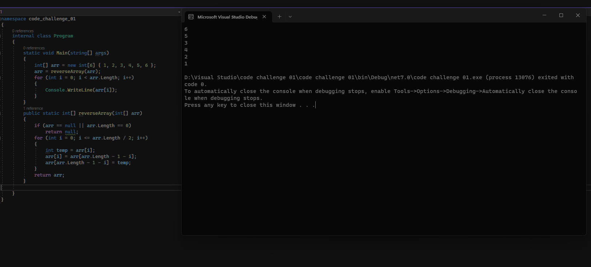

# Reverse Array

this challenge aimed at us creating a function that takes an int array as a parameter and reverses it without using built in functions

## Whiteboard Process

## Approach & Efficiency

i took the approach of keeping it simple. I defined a new array with the same size as the parameter array and started a for loop from zero until less than the parameter array length. then store the reversed values using this formula

    returnArr[arr.length-1-i] = arr[i]
    //where i is the elemant that the for loop is going through
at the end i returned the newly created array that had the reversed data stored into

time complexity O(n)

space complexity O(n)

## Solution

My function should be called and given an int array as a parameter.

if the value of the reversed array needs to be used store it.

## Stretch goal

our stretch goal was to check other ways to do the same task

## Whiteboard process

.png)

## Approach & efficiency

in my aim to make the running of the function less complex i saw that i can drop the new array requirement and instead go for a swapping based method which changes the location of the first and last element then the second and second last and so on

the result of this improvement is the space complexity went from O(n) to O(1) but the time complexity remained the same at O(n)

## solution

