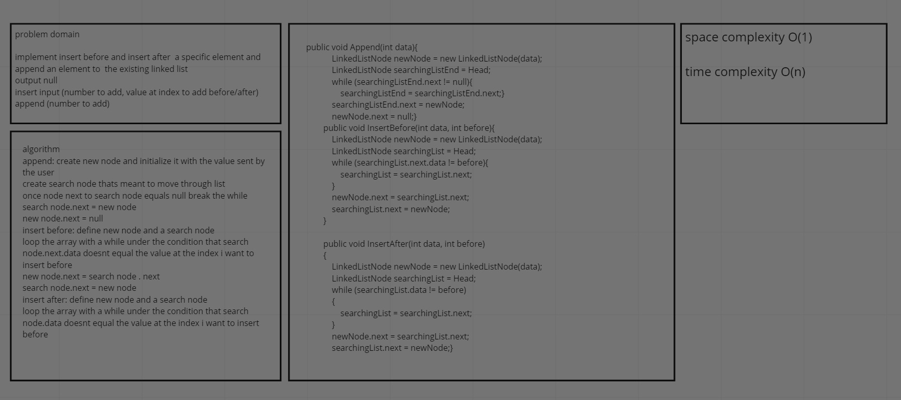
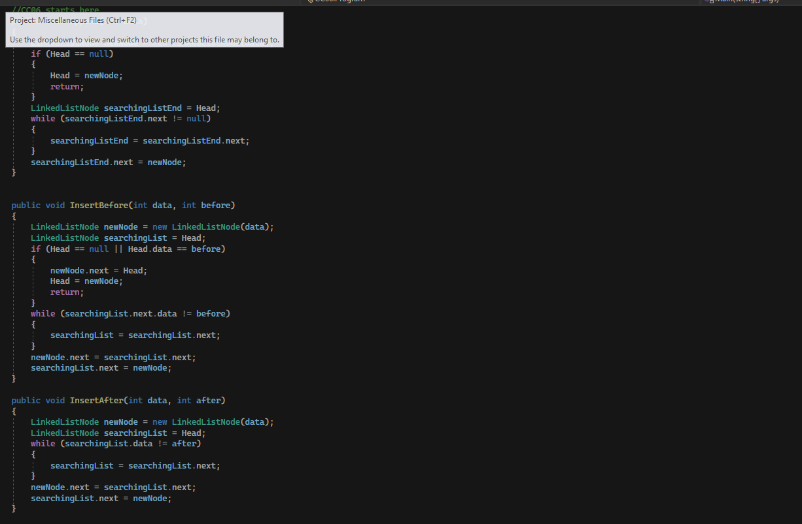
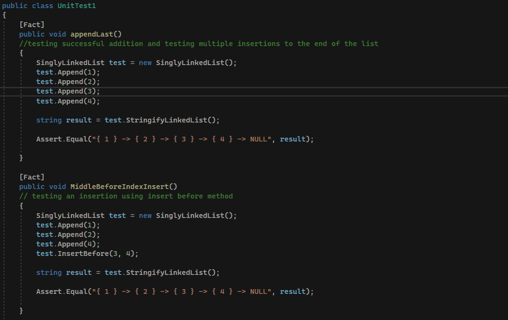
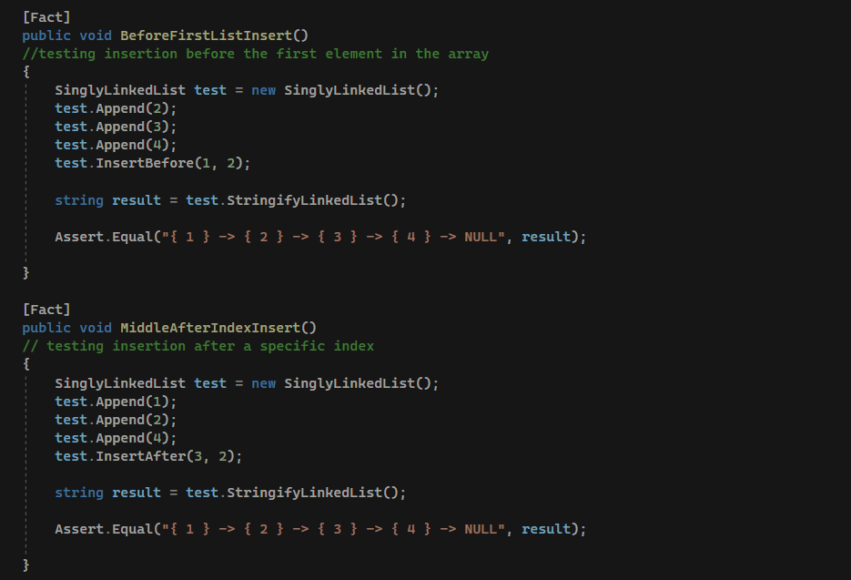
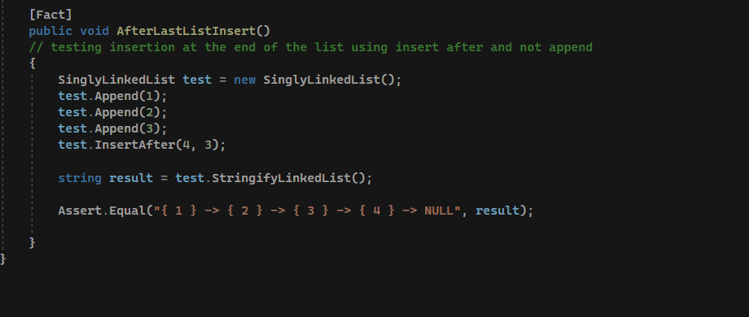

# linked list insertions

this is a follow up to the last CC intended to implement insertions at different positions (before/after/at the end of list)

## whiteboard

## approach and efficiency

keep it stupid simple. while loop through the list and check for the specific condition (insert before/after/end of)
space complexity O(1)
time comeplexity O(N)

## solution

