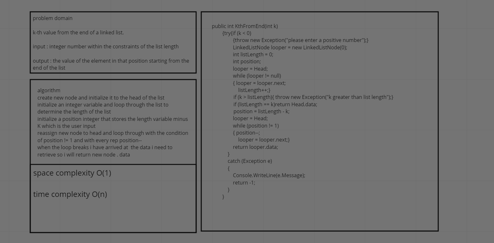
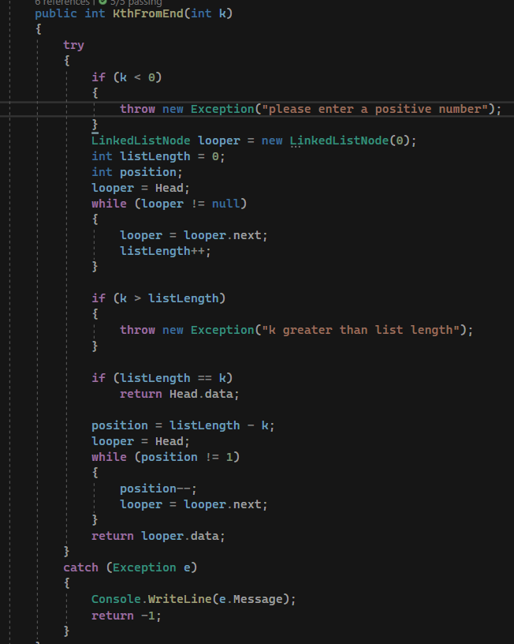
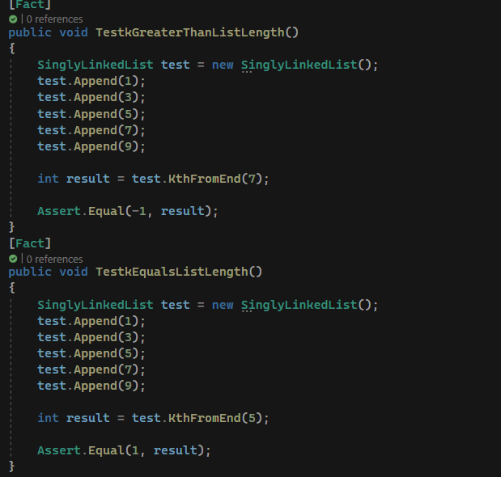
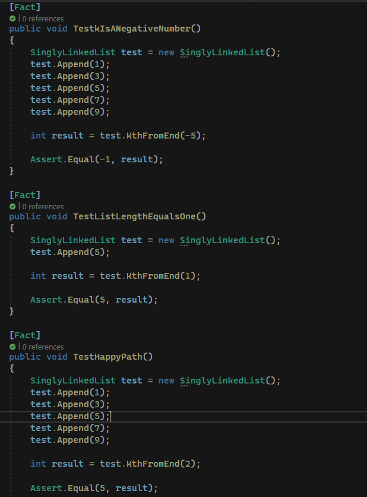

# Kth element from the end of a linked list

this function determines the length of the list and then steps from the end of the list based on user input and returns the value in that element

## whiteBoard process

## approach and efficiency

keep it simple and use the most obvious answer

space complexity O(1)

time complexity O(n)

## solution

### unit tests

