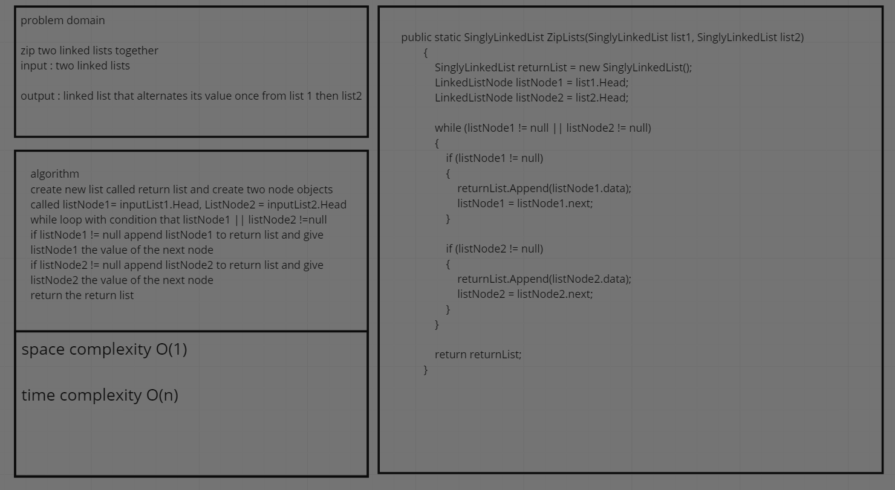
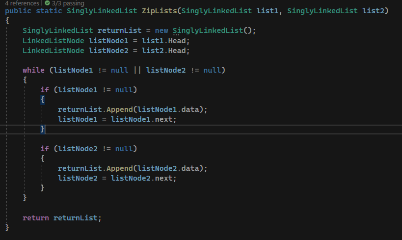
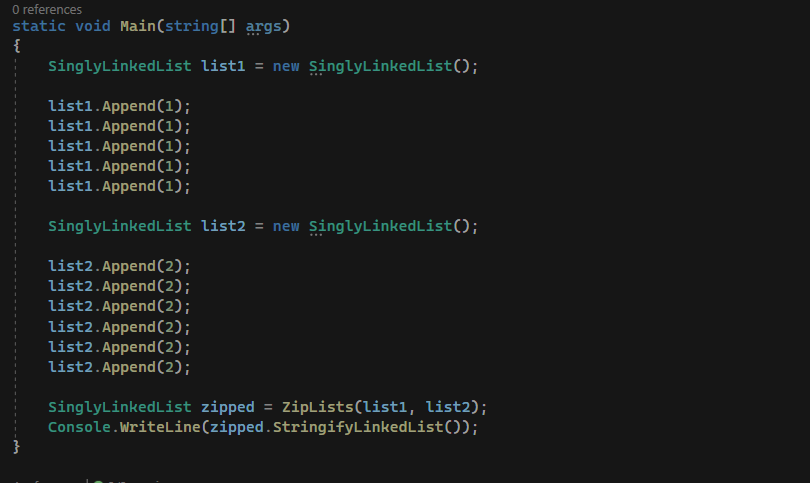
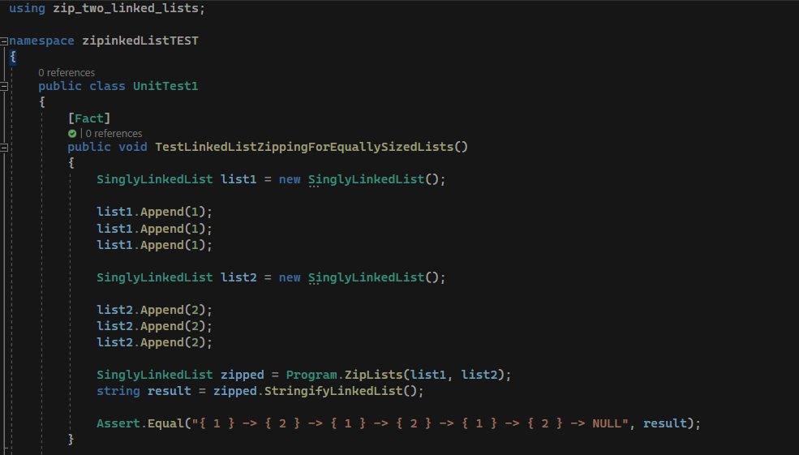
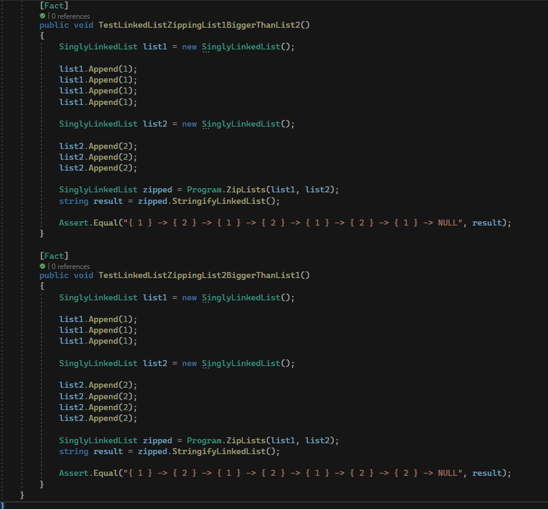
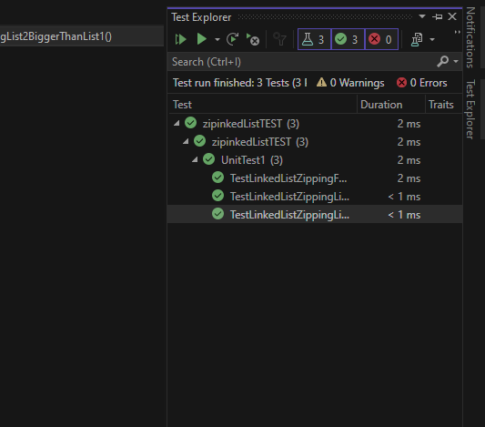
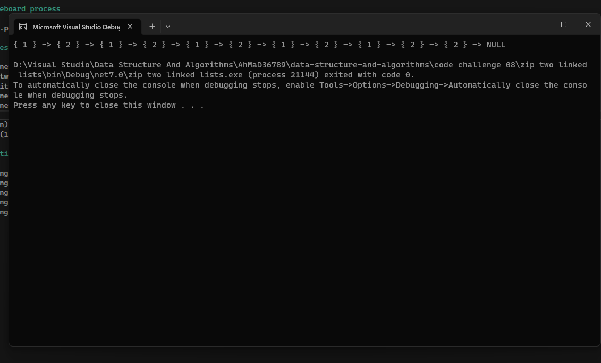

# zip two linked lists

function that recieves two linked lists as input and return a linked list whose value alternate between list 1 and list 2

## whiteboard process

## process and efficiency

create new list
create two node element and equate them to respective list heads
while either node1 OR node2 != null
add to new list
return new list

TIME O(n)
SPACE O(1)

## solution

