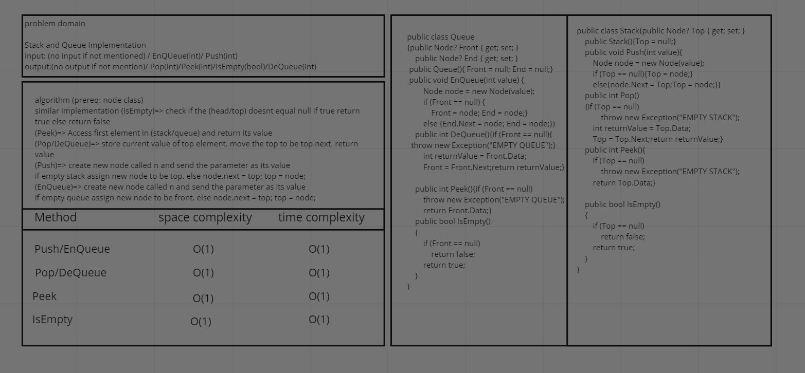
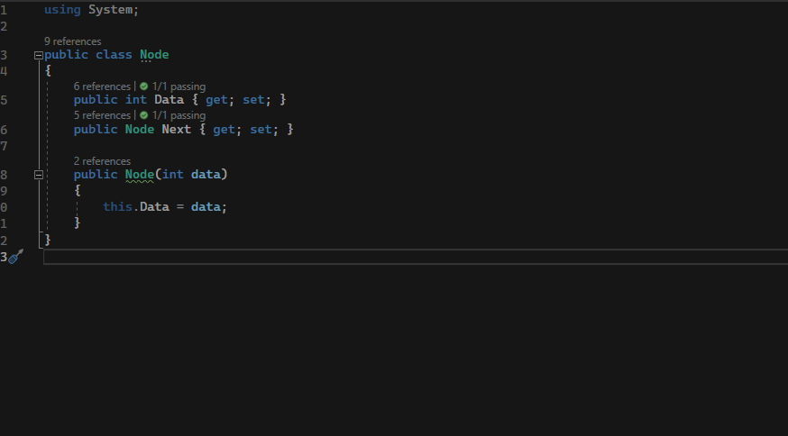
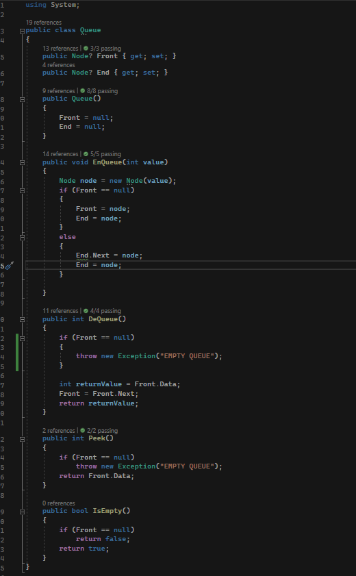
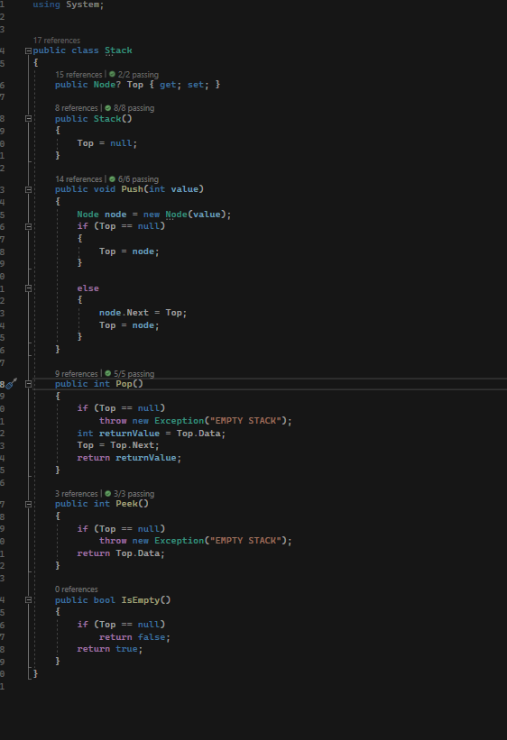
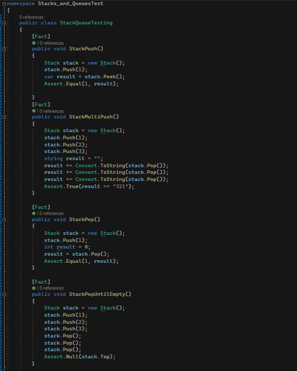
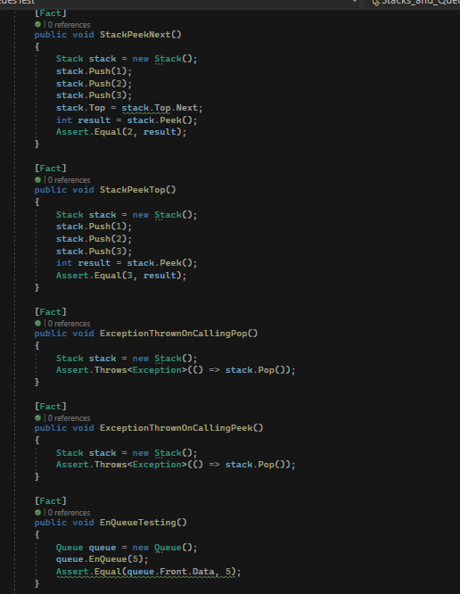
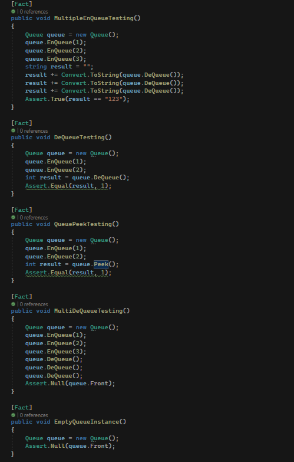
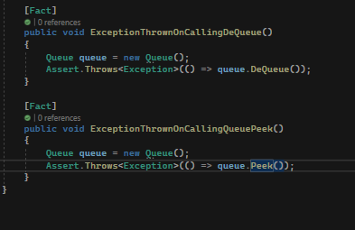

# Stack and Queue implementation

This challenge aimed at us learning how to implement a basic stack and a basic queue and do some simple operations on them

## whiteboard

## approach and efficiency

keep it stupid simple. meaning  i tried my best to keep the implementation as simple as possible

time and space complexity O(1)

## Solution

