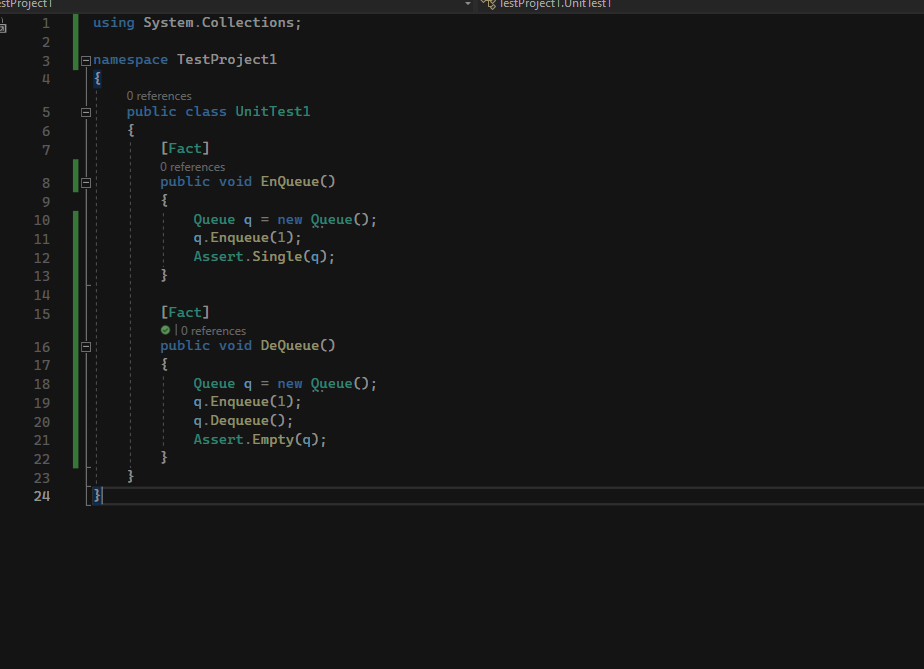
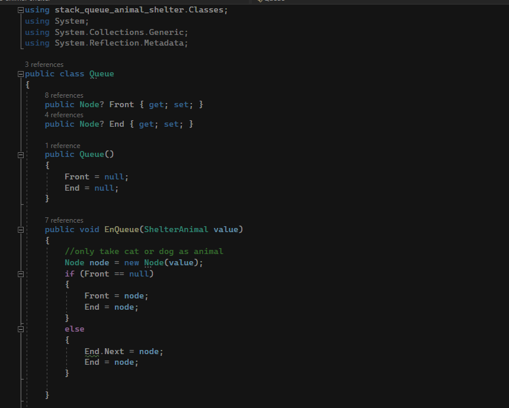
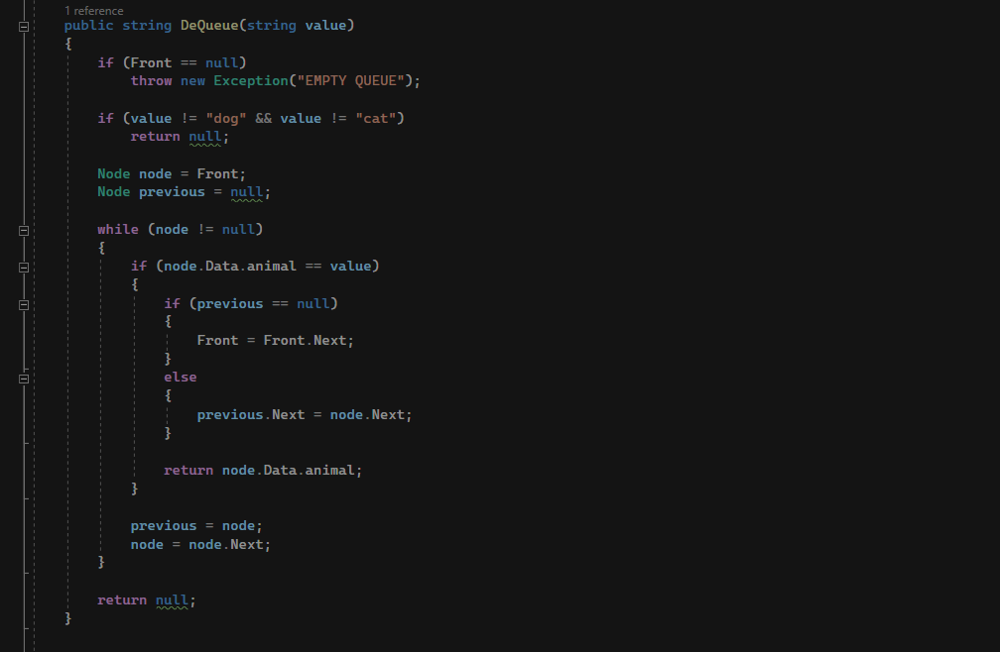
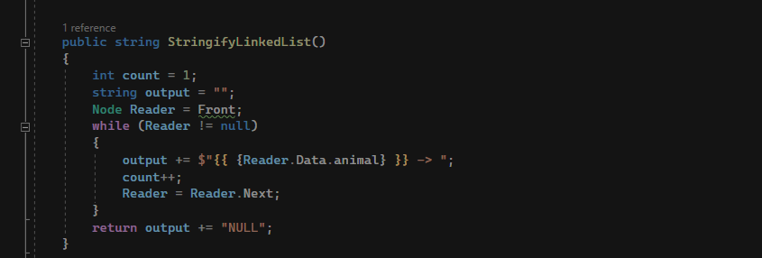

# Animal shelter

this program simulates adding dogs and cats to a shelter and removing them

## whiteboard

No whiteboard as this is a simple queue and dequeue operation

## efficiency

enQueue: time O(1) space O(1)
deQueue: time O(n) space O(1)

## solution

