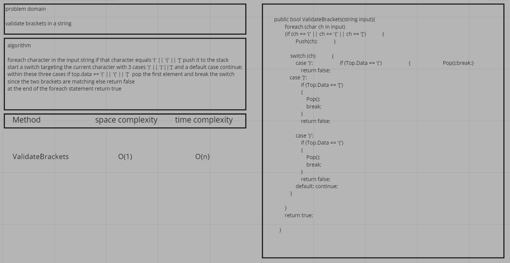
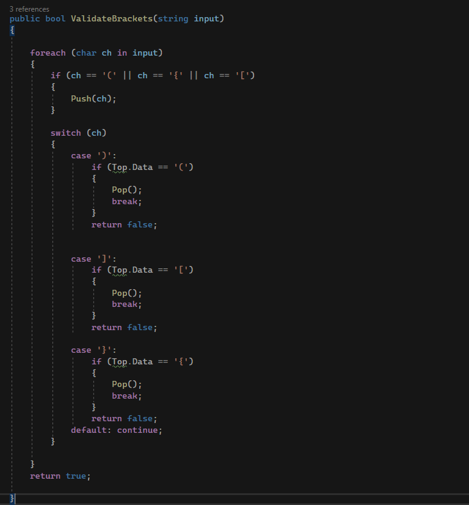
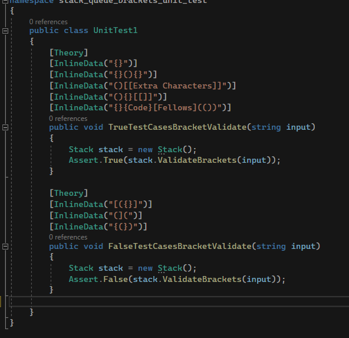

# validate brackets

this is a method utalizing stack to validate the bracket usage in a string 

## whiteboard

## process and efficiency

time complexity O(n)

space complexity O(1)

## solution

