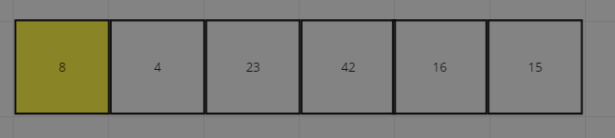
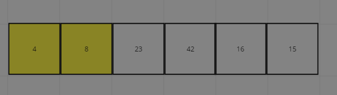
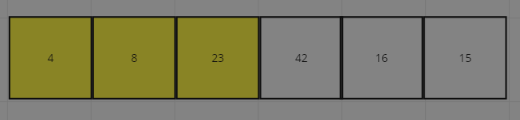
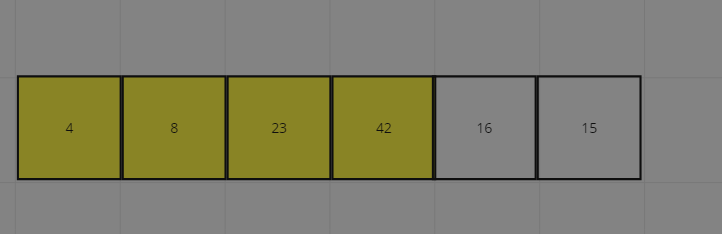
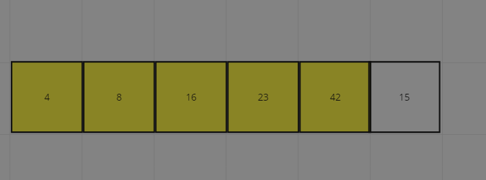
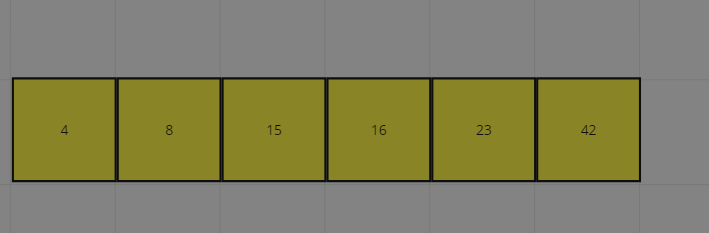

# InsertionSort

Insertion sort is a simple sorting algorithm that works by dividing an array into a sorted and an unsorted part. Values from the unsorted part are picked and placed at the correct position in the sorted part. It’s an efficient algorithm for small data sets and is easy to implement.

## pseudo Code
	Insert(int[] sorted, int value)
        initialize i to 0
    WHILE value > sorted[i]
        set i to i + 1
    WHILE i < sorted.length
        set temp to sorted[i]
        set sorted[i] to value
        set value to temp
        set i to i + 1
    append value to sorted

    InsertionSort(int[] input)
        LET sorted = New Empty Array
        sorted[0] = input[0]
    FOR i from 1 up to input.length
        Insert(sorted, input[i])
        return sorted

## Step by step

### First element is assumed sorted

### next element is checked as a key if its bigger or smaller of the currently sorted

### 23 bigger than 8 so it stays in place and is considered sorted

### same goes for 42 it stays in place and is sorted

### 16 is moved to be located after 8 but before 23

### 15 is moved between 8 and 16
