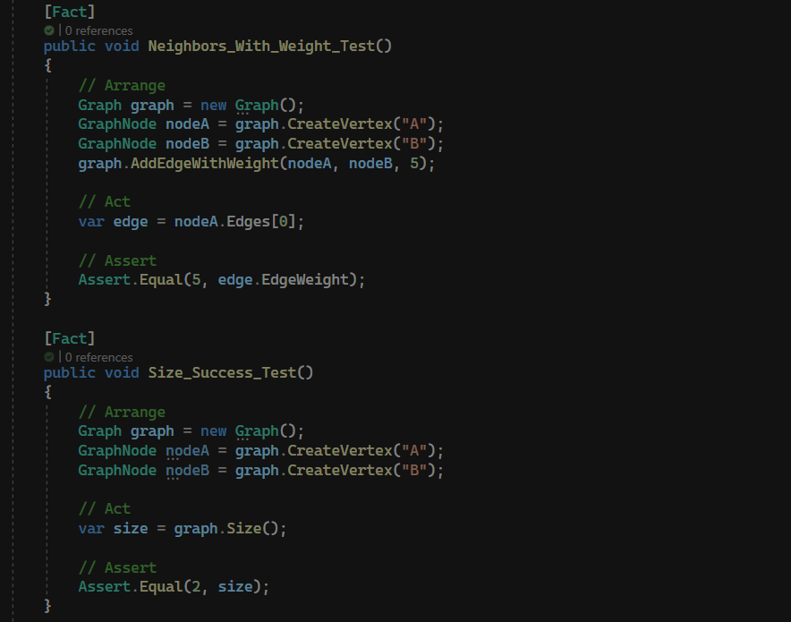

# Graph

This is our initial attempt at creating a Graph utalizing a HashTable

## whiteboard

No whiteBoard as this is a class implementation

## process and efficiency

time complexity Not Applicable as this task is about the implementation of a class 

space complexity Not Applicable as this task is about the implementation of a class 

## solution

